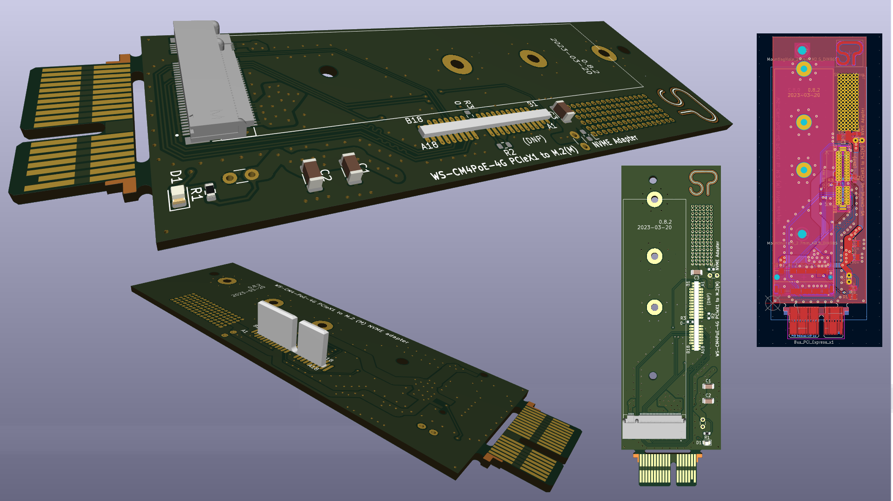
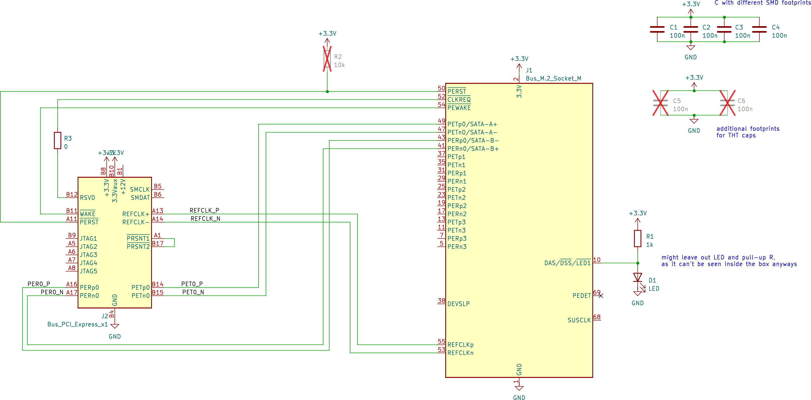
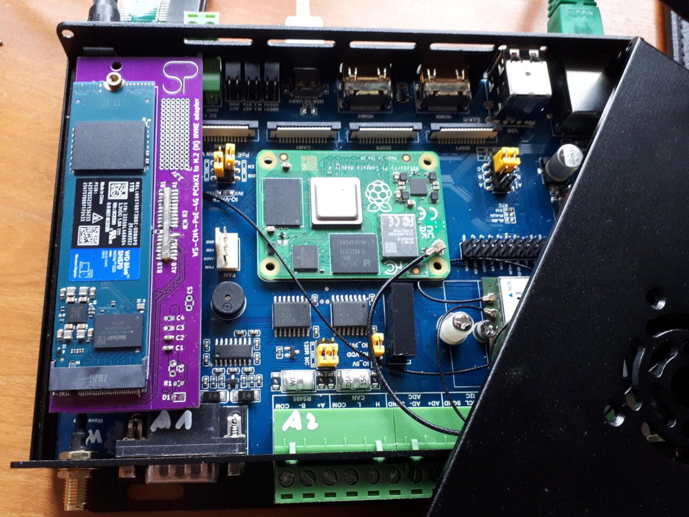

# CM4-IO-POE-4G PCIEx1 to NVME Adapter

This is an NVME (M-key) adapter board for the PCIEx1 slot.

It is designed to fit the [Waveshare CM4G-IO-POE-4G-BOX](https://www.waveshare.com/wiki/Compute_Module_4_PoE_4G_Board#Isolation_GPIO.2FI2C).

## Building

The PCB is cost-optimized to be produced by services like JLCPCB.

You have to separate the finger board from the PCB and solder it into its slot.
Make sure the finger board is at right angles to the main PCB when soldering.

An NVME M-key connector, a standoff, and screw for mounting the NVME has to be provided.
It is recomended to fix the board to the CM4 board with standoffs, not rely solely on the PCIEx1 connector to hold everything in place. For doing this, there are two holes matching holes in the baseboard PCB,

The adapter seems to work fine on the CM4 board without fitting the passives (capacitors and LED).

## Improvement ideas

 * chose gold fingers for production (I went as cheap as possible with HASL)

 * get out of the way for the CAM0 FPC cable

## Revisions

 * 0.8.2 finger board improvements, minor size adjustments

 * 0.8.1 working version, gone into small production run

